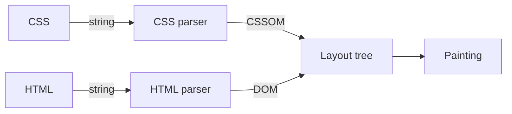
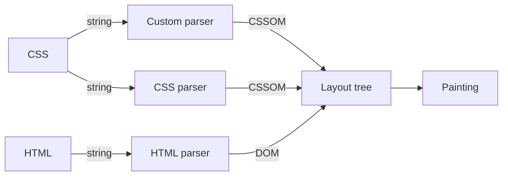
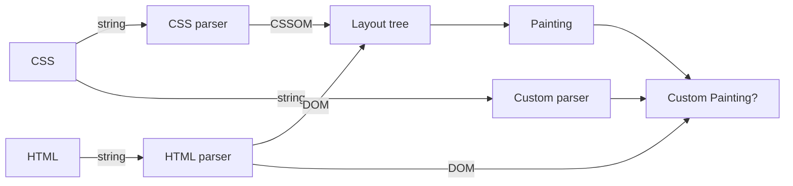

# CSS polyfill とその未来
@Megro.css

<!--
前回のmegroesが終わって2次会的なところに行った時にちょうどこの話をしてたんですよね。
なんでCSSにpolyfillが無いのかとかあったらいいのにねとか。
それからしばらくして、いろいろなきっかけもあり調べる機会があったのでお話させていただこうと思います。
というわけでCSS polyfillについて話します。よろしくお願いします。
-->

---
src: "../reuse/me.md"
---

---
layout: center
---

## CSSの新機能 **プロダクションで** 使えていますか？

<!--
はい本題です、みなさんCSSの最新機能はプロダクション環境で使えてますか？
まあやんごとなき理由っで難しいってこともありますが最近は良い基準がありますよね。
-->

---
layout: center
---


<!--
はいBaselineです。
-->

---

## Baseline Widely available

- `:is()` / `:where()`
- `width: fit-content / min-content;`
- `@layer`
- `display: block flex;` (display Multi-keyword values)
- `clamp()` / `min()` / `max()`

<!--
Baselineではこれだけの機能がWidely availableとして広く使えるものとして定義されています。
まあただこれはあくまで指標を提示してくれるのであって使えなかった機能を使えるようにはしてくれません。
-->

---

<div style="display: flex; algin-self: center; justify-content: center; height: 100%; padding: 64px; gap: 32px;">


</div>

<!--
一方で（自分は）JSを書くとき互換性をあまり気にしたことは無いです、それはなぜでしょうか？
-->

---

<div style="display: flex; height: 25%; padding: 8px; gap: 8px;">


</div>

- 構文のトランスパイル
  - typescript / babel
- 組み込みオブジェクトのサポート
  - core-js / promise-polyfill
- 利用できないAPIの制限
  - @eslint/compat / typescript(lib option)

<!--
JSを生で書くというのは最近はめっきり減ってきて、トランスパイルやバンドルの処理を挟むことが多くなってきていますね。
そのような中でTSがダウンレベリングをしてくれたり、core-jsのpolyfillを自動的に入れてくれたりとかそういうことが行われていて、使えない機能を静的解析で弾いてくれるたりして（正しく環境構築していれば）JSは互換性を気にするコストというのは殆ど無いというのが現実じゃないかなと思います。
-->

---


- 構文のトランスパイル
  - post-css plugins / Sass
- プロパティのサポート
  - ❌️ => polyfillが必要
- 利用できないAPIの制限
  - stylelint-browser-compat

<!--
一方でCSSはどうでしょうか？古くはCSS変数や:hasなどがpost-cssのプラグインやSass等で提供されていましたがこれはトランスパイルであり対応範囲には限界があります。
静的解析でエラーを出してくれるのはありますがランタイム上（ブラウザ）の動的な処理を補完してくれるわけではありません。
-->

---
layout: section
---

## なぜCSSのPolyfillは実現が難しいのか

<!--
はい、前提の共有は終わったのでなぜCSSのPolyfillは実現が難しいのか考えていきましょう。
-->

---

### なぜCSSのPolyfillは実現が難しいのか

`new-feater`という新しいプロパティのpolyfillを作ることを考えます。

```css{3}
:root {
  display: block flex;
  new-feater: inherit;
}
```

<!--
例として新しいプロパティ`new-feater`のpolyfillを作ることを考えます。
この時CSSというのはまず、未知のプロパティを無視しますね。
-->

---

### なぜCSSのPolyfillは実現が難しいのか



<!--
そうするとまずはこの図のCSS parserに介入できるようになれればよさそうって感じです。
HTMLのpolyfillはWCで作られてたりするのでcustomElementRegistryみたいに事前に登録しておくとかでもいいかもしれません。
-->

---

### なぜCSSのPolyfillは実現が難しいのか



- 特定の`keyword`や`selector`/一部の`at-rule`の拡張が可能になりそう。
- ただこれだけではLayoutなどには関与できない。

<!--
はいじゃあCSS Parserに介入（フック）できたら、処理をJS側に移譲して色々出来そうですね。
独自のセレクターとかも作れそうだし、独自のアットルールとかも作れそうな気がします。
ただこれだけだとレイアウトとかに介入するのは厳しいかもしれません。
-->

---

### なぜCSSのPolyfillは実現が難しいのか



<!--
というわけで次にカスタムペインティングとでも言いましょうか、レンダリングに関与できるAPIがあるといいですね。
そうするとかなりCSS polyfillというのは現実的になってくるんじゃないかなと思っています。
なんかそういうAPIあったらいいな…無いかな…
-->

---


<!--
というわけで自分がこれを調べるきっかけになった記事があるのでぜひ読んでほしいという話でした。
Houdiniが再始動することに心躍らせながらいきていこうかなと思います。
ちょっとここではかなり雑な説明しか出来なかったので興味がある人は後で話しかけてください！ありがとうございました！！
-->
