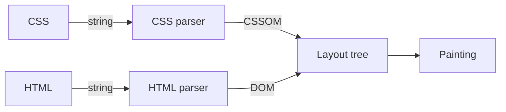
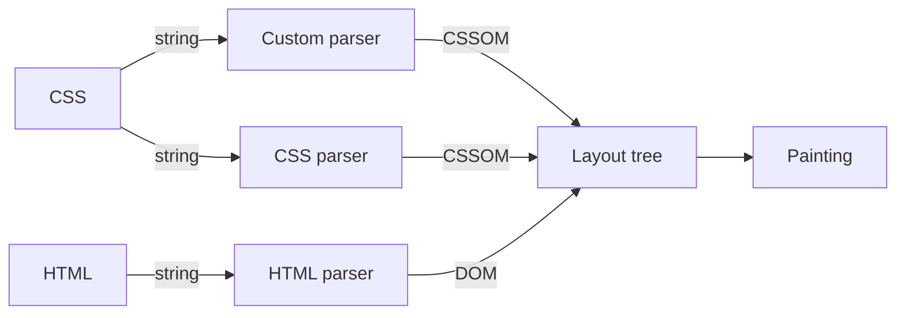
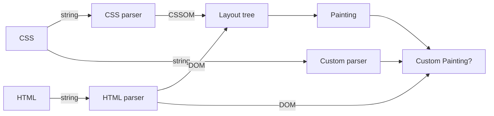

# CSS polyfill とその未来

---
src: "../reuse/me.md"
---

---
layout: center
---

## CSSの新機能 **プロダクションで** 使えていますか？

---
layout: center
---


<!--
こういった時に最近はbaselineを参照すると思います。
-->

---

## Baseline Widely available

- `:is()` / `:where()`
- `width: fit-content / min-content;`
- `@layer`
- `display: block flex;` (display Multi-keyword values)
- `clamp()` / `min()` / `max()`

<!--
Baselineではこれだけの機能がWidely availableとして広く使えるものとして定義されています。
これはあくまで使えない機能の基準を出してくれているだけであり使えるようにしてくれるわけではありません。
-->

---

<div style="display: flex; algin-self: center; justify-content: center; height: 100%; padding: 64px; gap: 32px;">


</div>

<!--
一方で（自分は）JSを書くとき互換性をあまり気にしたことは無いです、それはなぜでしょうか？
-->

---

<div style="display: flex; height: 25%; padding: 8px; gap: 8px;">


</div>

- 構文のトランスパイル
  - typescript / babel
- 組み込みオブジェクトのサポート
  - core-js / promise-polyfill
- 利用できないAPIの制限
  - @eslint/compat / typescript(lib option)

<!--
それはこのように構文の変換（トランスパイル）やpolyfillが挿入されているからです。
-->

---


- 構文のトランスパイル
  - post-css plugins / Sass
- プロパティのサポート
  - ❌️ => polyfillが必要
- 利用できないAPIの制限
  - stylelint-browser-compat

<!--
一方でCSSはどうでしょうか？
古くはCSS変数や:hasなどがpost-cssのプラグインやSass等で提供されていましがCSSのpolyfillというのは実現が難しい領域があります。
-->

---
layout: section
---

## なぜCSSのPolyfillは実現が難しいのか

<!--
前提の共有は終わったのでなぜCSSのPolyfillは実現が難しいのか考えていきましょう。
-->

---

### なぜCSSのPolyfillは実現が難しいのか

`new-feater`という新しいプロパティのpolyfillを作ることを考えます。

```css{3}
:root {
  display: block flex;
  new-feater: inherit;
}
```

<!--
例として新しいプロパティ`new-feater`のpolyfillを作ることを考えます。
-->

---

### なぜCSSのPolyfillは実現が難しいのか



---

### なぜCSSのPolyfillは実現が難しいのか



- 特定の`keyword`や`selector`/一部の`at-rule`の拡張が可能になりそう。
- ただこれだけではLayoutなどには関与できない。

---

### なぜCSSのPolyfillは実現が難しいのか



- まさしく `Houdini Re-Revisted` のような感じ
- `masonry` レイアウトを作ったりもできるようになる？

---

- `details` は9年
- `dialog` は8-10年

大きな機能の標準化は長い月日を必要とする。
CSS polyfillが使えるようになるまでの道のりは長そう。
