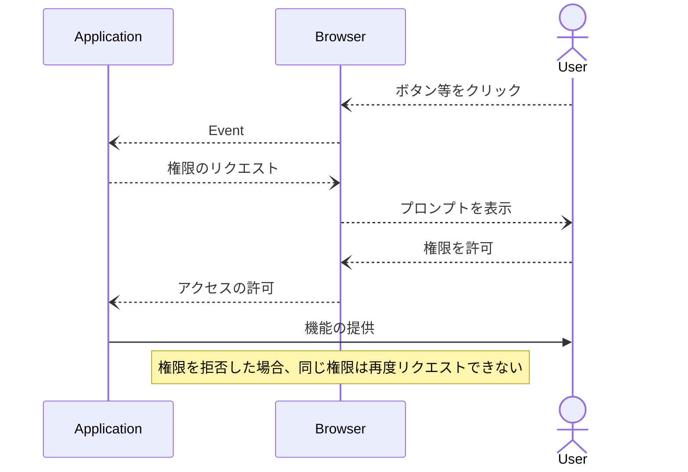
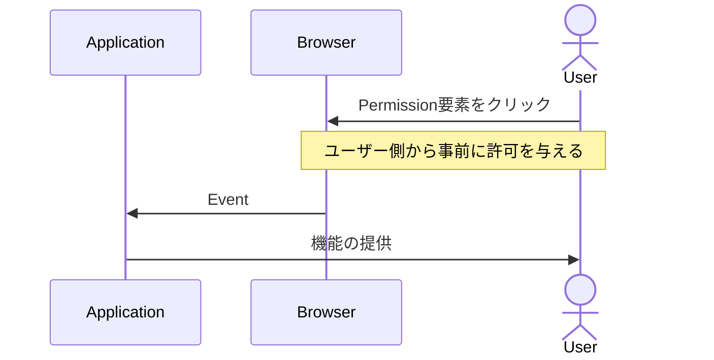

# PEPCは何を変えようとしていたのか
[@JSConf.jp おかわり Node学園46時限目](https://nodejs.connpass.com/event/344588/)

<!-- 事前にMeetの権限リクエスト画面を用意しておく -->

---
src: "../reuse/me.md"
---

---
layout: section
---

## PEPCとはなにか

---
layout: section
---

### PEPC = Page Embedded Permission Control

---

### PEPC = Page Embedded Permission Control

一番大きい変更としては `<permission>` 要素を追加すること。

- クリック時に指定した権限の許可がトリガーされる
- UIはUAから提供されクリック ジャッキングなどができない
- 権限の許可と種類がセマンティックとして定義される
- 一度権限を拒否しても再度クリックすることで許可のリクエストが発行される

Chrome 126-137 にてOrigin Trialが行われている。

既存のブラウザのパーミッションモデルを大きく変えようとする提案。

---
layout: section
---

## 現在のブラウザにおける権限管理

---

## 現在のブラウザにおける権限管理


<em style="font-size: 16px;">Chromeの場合、権限が必要なAPIが呼ばれるとオムニボックスの下にプロンプトが現れユーザーに許可を求める。</em>

---

## 権限が必要な機能の実装

- アプリケーションの実装としては非同期処理として素直に実装すればいいだけ
- `then...catch`とかでエラーハンドリング

```ts
try {
  await navigator.getUserMedia({
    audio: true,
    video: true,
  }, () => {}, () => {});
} catch (e) {
  // ...
};
```

実装としてはそれでいいが、本当に使いやすいのか？

---

## 現在の権限管理の問題点

- どの要素がどの権限のリクエストを行うかがセマンティックとして表現されていない
- 権限のリクエストを行った要素とプロンプトの位置の乖離
- "permanent deny" policy により誤った権限拒否の訂正を行うのが難しい

---

### "permanent deny" policy

ユーザーが許可するまでプロンプトを出し続けるというスパムができないように、一度拒否した権限リクエストはアプリケーション側から再度リクエストができないようになっている。

> Many user agents implement a "permanent deny" policy, and other user agents offer it as an option in the permission prompt. This means that a site will not be able to ask for permission again after the user has blocked it.

https://github.com/WICG/PEPC/blob/main/explainer.md#user-agent-abuse-mitigations

---
layout: section
---

## 権限のリクエスト方式

---

## 現在のパーミッションリクエスト



<!--
図の要点としてはユーザーエージェントとユーザー間で２回のやり取りが必要になる点
-->


---

## PEPCでのパーミッションリクエスト



---

## 何が変わるのか

- 従来はアクション後にプロンプトが表示され計２回のアクションが必要になる。  
- PEPCでは許可しつつイベントを処理でき１度のアクションで機能を提供できる。
- ユーザー起点の許可なのでスパムの心配がなく拒否からの復帰が楽になる。
- 要素がどの権限を許可するものなのかがセマンティックとして明確になる（はず）。

https://permission.site/pepc

<!--
「はず」と書いているのはあくまでセマンティック関連の話はARIAの話なのでARIAとのインテグレーションが必要になるため。
-->

---
layout: section
---

## 課題がめちゃくちゃ多いのも事実 

---

### PEPCの課題

Webkit,MozillaともにStandard positionはNegative寄り。

- https://github.com/WebKit/standards-positions/issues/270
- https://github.com/mozilla/standards-positions/issues/908 

最大の懸念であるクリックジャッキングの対策のため非常に複雑な仕様に…

---
layout: section
---

### なぜ複雑な仕様になってしまうのか

---

### なぜ複雑な仕様になってしまうのか

素直に実装してしまうと

- 画面全体に透明なpermission要素を設置できてしまう
- アプリケーション側からEventをdispatchできてしまう
- ユーザーが別の要素をクリックする直前に前面にpermission要素を表示する

などクリックジャッキングが可能になってしまう。

---

### なぜ複雑な仕様になってしまうのか

クリックジャッキング対策のために

- 表示されるテキストはUAが管理する
- CSSの指定をホワイトリスト形式に
- 要素のレンダリング上限の制限
- サブフレームでの使用条件の制限
- クリックイベントのdispatchに対する制限
- クリックの直前にPEPCが移動していないこと
- クリックの直前にPEPCが（他の要素に覆われていない）見えていること
- クリックの直前にPEPCがNodeに挿入されていないこと

などの対策を行う必要があることが一番大きな要因

<!--
CSSの制限については主に透明化して全画面表示にしたりすることの対策
要素のレンダリング数上限はpermission要素で画面全体をタイル状に覆い尽くすことへの対策
-->

---

### なぜ複雑な仕様になってしまうのか

UAがテキストを管理することとCSSの制限に関連して、CSSで Upper case に指定した場合にテキストの意味が変わってしまう言語はあるのかなどの懸念も

[Styling button text-transform (capitalize/uppercase/lowercase) #28](https://github.com/WICG/PEPC/issues/28)

---
layout: section
---

## PEPCの現状

---

## PEPCの現状

- Webkit,Mozillaの反対意見は根強い
- セキュリティ的な懸念や余計な複雑性が発生しているのは事実
- 大きく問題を2つに分けて代替え案なども検討されている
  - 権限リクエストのプロンプトを改善する方向
  - 権限の許可フローの改善

---

## PEPCの現状

- 現状のままでは標準化は非常に厳しい状態である。
- やりたいことは分かるし、需要もありそうだが理解を得られる実装ではない。
- 一方で代替え案や`<portal>`要素のように機能の分割も有り得そう。

今後の動向によってはパーミッションモデルの変化があるかもしれない。

<!--

-->

---
layout: section
---

## ありがとうございました！

