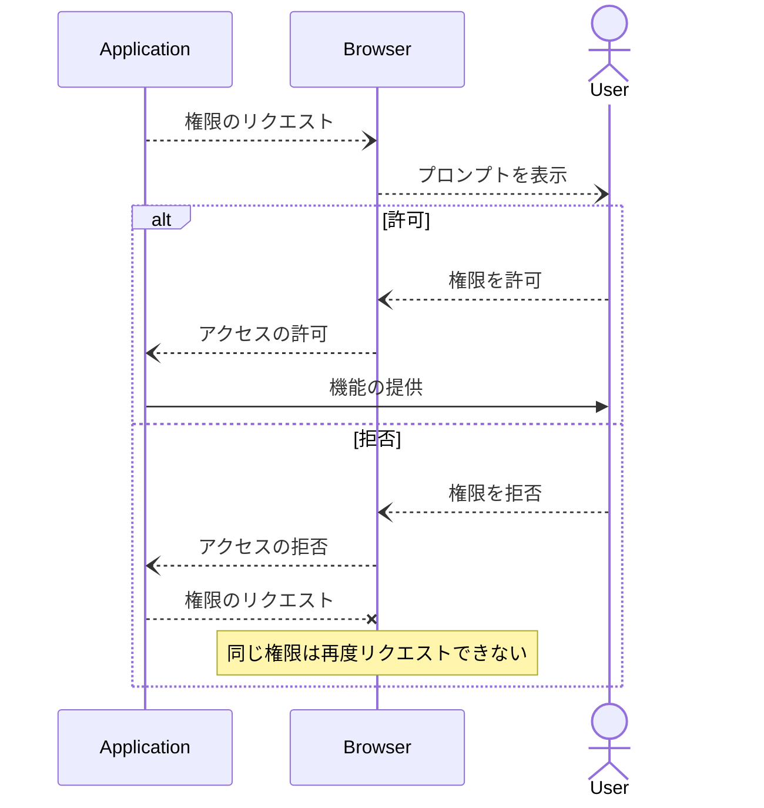
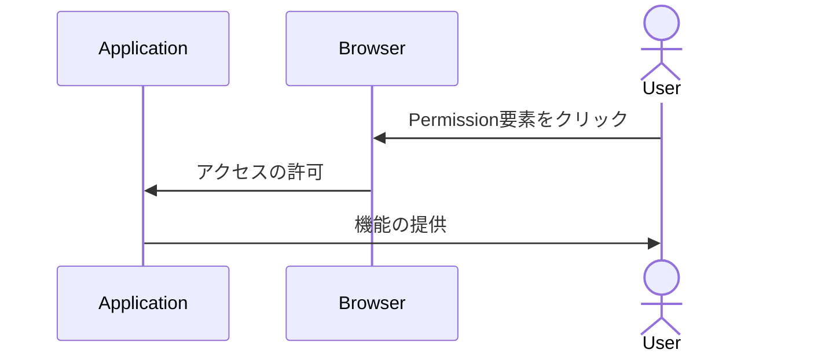

# PEPCは何を変えようとしているのか

---
src: "../reuse/me.md"
---

---
layout: center
---

## 権限のリクエスト方式

---

## 現在のパーミッションリクエスト

```mermaid
sequenceDiagram
    participant Application
    participant Browser
    Actor User
    Application--)Browser: 権限のリクエスト
    Browser--)User: プロンプトを表示

    alt 許可
    User--)Browser:権限を許可
    Browser--)Application: アクセスの許可
    Application->>User: 機能の提供
    else 拒否
    User--)Browser:権限を拒否
    Browser--)Application: アクセスの拒否
    Application--xBrowser: 権限のリクエスト
    Note over Browser: 同じ権限は再度リクエストできない
    end
```

---

## PEPCでは

```mermaid
sequenceDiagram
    participant Application
    participant Browser
    Actor User
    User->>Browser: Permission要素をクリック
    Browser->>Application: アクセスの許可
    Application->>User: 機能の提供
```
