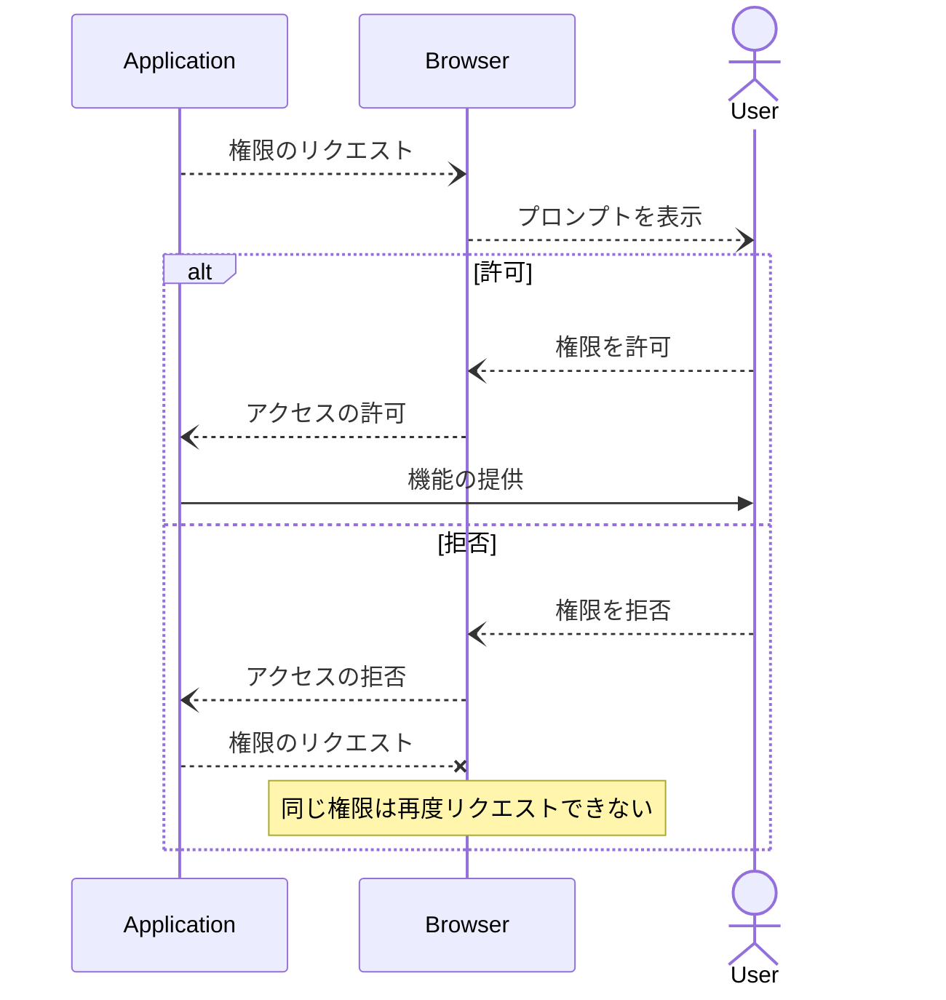
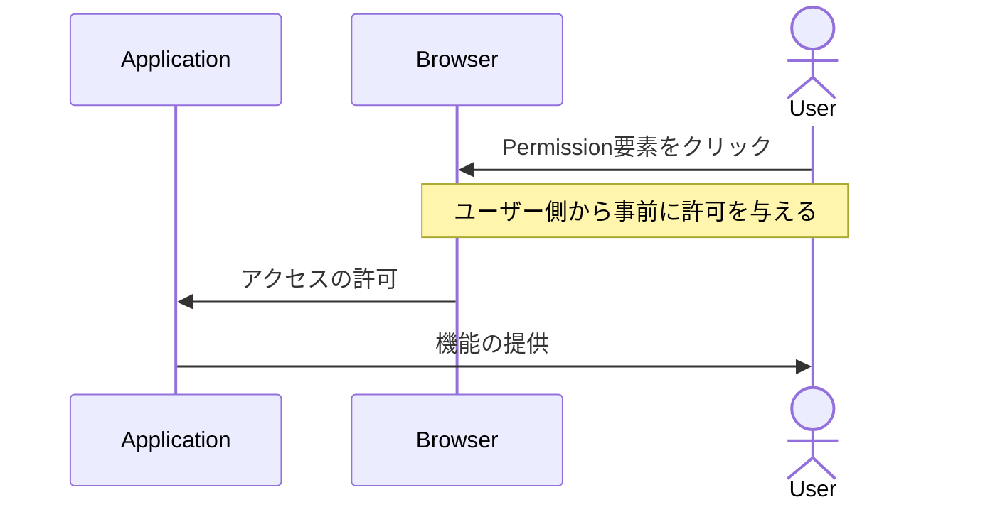

# PEPCは何を変えようとしているのか

---
src: "../reuse/me.md"
---

---
layout: section
---

## 権限が必要な機能の実装

通知、メディアデバイスアクセス、位置情報などなど  

---

## 権限が必要な機能の実装

- アプリケーションの実装としては非同期処理として素直に実装すればいいだけ
- `then...catch`とかでエラーハンドリング

```ts
try {
  await navigator.getUserMedia({
    audio: true,
    video: true,
  }, () => {}, () => {});
} catch (e) {
  // ...
}
```

実装としてはそれでいいが、本当に使いやすいのか？

---
layout: section
---

## 現在のブラウザにおける権限管理

---

## 現在のブラウザにおける権限管理


<em style="font-size: 16px;">Chromeの場合、権限が必要なAPIが呼ばれるとオムニボックスの下にプロンプトが現れユーザーに許可を求める。</em>

---
layout: section
---

### "permanent deny" policy

---

### "permanent deny" policy

> Many user agents implement a "permanent deny" policy, and other user agents offer it as an option in the permission prompt. This means that a site will not be able to ask for permission again after the user has blocked it.

ユーザーが許可するまでプロンプトを出し続けるというスパムができないように、一度拒否した権限リクエストはアプリケーション側から再度リクエストができないようになっている。

https://github.com/WICG/PEPC/blob/main/explainer.md#user-agent-abuse-mitigations

---
layout: section
---

## 権限のリクエスト方式

---

## 現在のパーミッションリクエスト



---

## 現在のパーミッションリクエスト

現在のパーミッションリクエストはセキュリティ面では安全であるが

- 間違って拒否してしまった場合、再度許可を行うのが難しい
- プロンプトの表示とユーザーが起こすアクションが必ずしも合致しない
- プロンプトの表示をトリガーした要素とプロンプトの位置が離れていること
- 権限の要求がトリガーされるということがセマンティックとして明らかでない

のような問題もある。

---

## PEPCでのパーミッションリクエスト



---

## PEPCでのパーミッションリクエスト

> A permission model designed to be initiated by the user would solve these issues.

従来のパーミッションリクエストはアプリケーション（JavaScript）が起点となっているのに対して、PEPCでは**ユーザーのアクションを起点としている**ことが異なる。

---
layout: section
---

## 課題がめちゃくちゃ多いのも事実 

---

### PEPCの課題

Webkit,MozillaともにStandard positionはNegative寄り。

- 仕様の複雑性
- セキュリティ面でのリスク
- i18n
- ブラウザ互換性

などが問題になっている。

#### Standard position

- https://github.com/WebKit/standards-positions/issues/270
- https://github.com/mozilla/standards-positions/issues/908 

---

### なぜ複雑な仕様になってしまうのか

素直に実装してしまうと

- 画面全体に透明なpermission要素を設置できてしまう
- アプリケーション側からEventをdispatchできてしまう
- ユーザーが別の要素をクリックする直前に前面にpermission要素を表示する

などなどユーザーの意図しない状況での権限許可が行われてしまう

---

### なぜ複雑な仕様になってしまうのか

自分が読んでいて面白かったissue

[Styling button text-transform (capitalize/uppercase/lowercase) #28](https://github.com/WICG/PEPC/issues/28)

現状はボタンのテキストもユーザーエージェントが提供する想定になっているがCSSでupper caseに指定した場合にテキストの意味が変わってしまう言語はあるのか。

CSSの適用がホワイトリスト形式になっているので考慮することが多くなっている。

---

## まとめ

- 大変そうだけど課題意識とかには共感できるので長期的な目線では応援したい。
- 仕様は意図が分かると面白い
