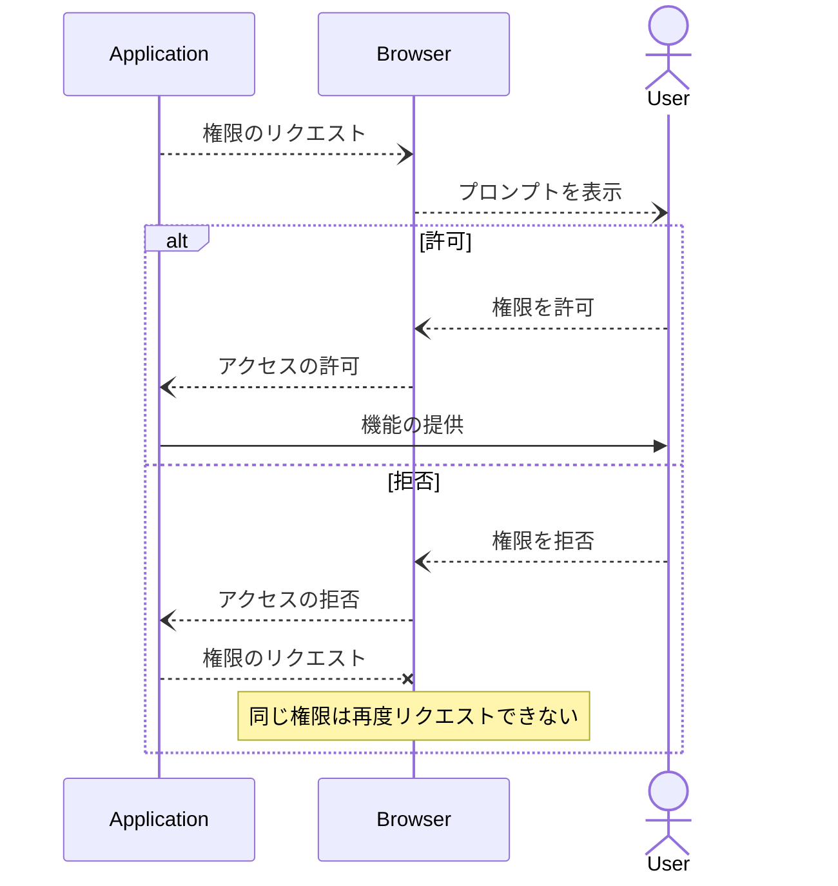
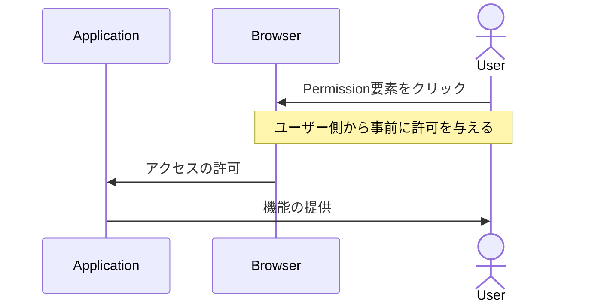

# PEPCは何を変えようとしているのか

---
src: "../reuse/me.md"
---

---
layout: section
---

## 現在のブラウザにおける権限管理

---

## 現在のブラウザにおける権限管理

<em style="font-size: 16px;">Chromeの場合、権限が必要なAPIが呼ばれるとオムニボックスの下にプロンプトが現れユーザーに許可を求める。</em>

---

## 現在のブラウザにおける権限管理

> Many user agents implement a "permanent deny" policy, and other user agents offer it as an option in the permission prompt. This means that a site will not be able to ask for permission again after the user has blocked it.

ユーザーが許可するまでプロンプトを出し続けるというスパムができないように、一度拒否した権限リクエストはアプリケーション側から再度リクエストができないようになっている。

https://github.com/WICG/PEPC/blob/main/explainer.md#user-agent-abuse-mitigations

---
layout: section
---

## 権限のリクエスト方式

---

## 現在のパーミッションリクエスト

---

## PEPCでは

---
